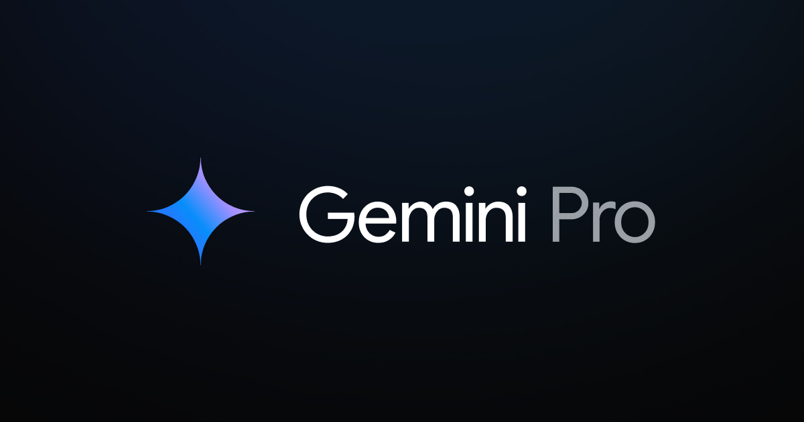

# **Custom Multi-Agent Recruiter with LangGraph**

<p align="center">
    
</p>
<p align="center">
    
    
</p>
<p align="center">
    
</p>


## **Introduction and motivation**


I have designed a Multi-Agent Recruiter [graph like] for processing and analyzing candidates' CVs for specific job offers. The architecture is based on the LangGraph framework and currently uses the following GPT LLM Transformer-Decoder models:

- **OpenAI-gpt-3.5-turbo**
- **Meta-llama3-70b-instruct**
- **Google-Gemini-Pro** (Coming soon!)

(I'm sure with the GPT-4.0 or GPT-4 model, the performance and the cost will increase :joy:)

Now, seriously, feel free to add any model to the code and to the architecture graph that the LangChain API supports. In future versions, I will add and compare different transformer-decoder architecture models. I might also fine-tune an open-source one for this specific use case. Stay tuned!

The Recruiter, using the provided job offer description, will output a score from 0 to 100 for the candidate's aptitude for the job. Under the hood, the Multi-Agent Recruiter will analyze the candidate's CV, extract relevant job experience and linked information (if found), and provide a description of why it assigned that score to the candidate according to the job offer and the CV.

For more low-level technical details of the system's architecture, the multi-agent graph, prompt engineering, or development queries, contact me at: jorgeresino143@gmail.com

## **Prerequisites**

1. **Install Python version 3.11 (just in case you haven’t already installed it :stuck_out_tongue_winking_eye:)**

   [Python official download website](https://www.python.org/downloads/)

2. **Install Git**

   [Git official download website](https://www.git-scm.com/downloads)

3. **Navigate to your local machine project directory and initialize a new Git repository for version control**

    On Windows:
    ```sh
    cd your/dir/path/
    git init
    ```

    *You may have to set your username and email at this point* -> [Git config tutorial](https://www.youtube.com/watch?v=yDntCIs-IJM)

4. **Clone this GitHub repository to your local machine directory**

    [Tutorial for beginners](https://www.youtube.com/watch?v=q9wc7hUrW8U)

    On Windows:
    ```sh
    git clone https://github.com/kokeitor/Custom-Multi-Agent-Recruiter.git
    ```
   
5. **Virtual environment setup**
  
    - Create your virtual environment
    
        On Windows:
        ```sh
        cd your/dir/path/
        python -m venv <venv_name>
        ```

    - Activate your virtual environment
    
        On Windows:
        ```sh
        <venv_name>\Scripts\activate
        ```

    - Install the necessary packages and libraries

        On Windows:
        ```sh
        pip install -r requirements.txt
        ```

    *WAIT for the installation to finish!* :smiley:

6. **API token/key configuration**
   
   Rename the *.env.example* file as *.env* and add your OpenAI , LangChain , NVDIA and Google keys

   ```
   OPENAI_API_KEY = "<your_openai_key>"
   LANGCHAIN_API_KEY = "<your_langsmith_key>"
   NVIDIA_API_KEY = "<your_nvidia_key>"
   GOOGLE_API_KEY = "<your_google_ai_studio_key>"
   ```

   [Fancy OpenAI Key tutorial](https://www.youtube.com/watch?v=aVog4J6nIAU)

   [Fancy LangChain [LangSmith] tutorial](https://www.youtube.com/watch?v=bE9sf9vGsrM)

   [Create an account and obtain NVDIA API KEY for : llama3-70b](https://build.nvidia.com/explore/discover#llama3-70b)

   [Google AI Studio Api key](https://ai.google.dev/aistudio?hl=es-419)


## **App modes**

To use the Custom Multi-Agent Recruiter, I have designed several **"app modes"** *some of which are still in the development phase*.

1. **One-Shot Pipeline Mode**

    - Set up the DATA configuration JSON file 

        Open the *config* folder and, inside the *data.json* file, add all the candidates' CVs (Curriculum Vitae or resumes) you want to analyze with the job offer linked to that analysis.

        *I have included, in the last JSON object inside this JSON array, an example or template you could tune for your specific case.*

        ***Note that with this template you ensure good performance of the model and the agents' analysis***

        ```json
        [
            {
                "oferta": "<job_offer_description_1>", 
                "cv": "<candidate_1_CV>"
            },
            { 
                "oferta": "<job_offer_description_2>", 
                "cv": "<candidate_2_CV>"
            },
            {
                "oferta": "Analista de Datos en Empresa Tecnológica",
                "cv": "Nombre: Carlos Ruiz\nResidencia: Calle del Parque 78, Ciudad Central\nCorreo: carlos.ruiz@ejemplo.com\nTeléfono: 555-456-7891\n\nEXPERIENCIA PROFESIONAL\n- Junio 2021 / Presente: Analista de Datos - TechData Solutions\n  Análisis de grandes conjuntos de datos, creación de dashboards, generación de informes.\n\n- Septiembre 2018 / Mayo 2021: Programador - Software Innovators\n  Desarrollo de software, pruebas de calidad, implementación de mejoras.\n\n- Enero 2016 / Agosto 2018: Soporte Técnico - HelpDesk Corp\n  Resolución de incidencias técnicas, soporte al cliente, mantenimiento de sistemas.\n\nFORMACIÓN ACADÉMICA\n- Finalizada en Mayo 2018: Ingeniería Informática, Universidad de Ciudad Central\n\nIDIOMAS\n- Inglés: Fluido (C2) en lectura, Fluido (C2) en oral, Fluido (C2) en escrita\n- Español: Nativo (C2) en lectura, Nativo (C2) en oral, Nativo (C2) en escrita\n\nHABILIDADES\n- Análisis de datos\n- Programación en Python y Java\n- Creación de dashboards\n\nOtros datos\n- Certificación en Data Science, 2020\n- Participación en proyectos de inteligencia artificial\n"
            }
        ]
        ```

    - Run the pipeline

        Navigate to the root of your local project where this *README.md* file is located using cmd on Windows:

        ```sh
        cd your/dir/path
        ``` 

        Then type:
        ```sh
        python src/app.py --mode pipeline
        ```

2. **LangGraph Multi-Agent CMD mode**

    - Set up the DATA configuration JSON file 

        Open the *config* folder and, inside the *data.json* file, add all the candidates' CVs (Curriculum Vitae or resumes) you want to analyze with the job offer linked to that analysis.

        *I have included, in the last JSON object inside this JSON array, an example or template you could tune for your specific case.*

        ***Note that with this template you ensure good performance of the model and the agents' analysis***

        ```json
        [
            {
                "oferta": "<job_offer_description_1>", 
                "cv": "<candidate_1_CV>"
            },
            { 
                "oferta": "<job_offer_description_2>", 
                "cv": "<candidate_2_CV>"
            },
            {
                "oferta": "Analista de Datos en Empresa Tecnológica",
                "cv": "Nombre: Carlos Ruiz\nResidencia: Calle del Parque 78, Ciudad Central\nCorreo: carlos.ruiz@ejemplo.com\nTeléfono: 555-456-7891\n\nEXPERIENCIA PROFESIONAL\n- Junio 2021 / Presente: Analista de Datos - TechData Solutions\n  Análisis de grandes conjuntos de datos, creación de dashboards, generación de informes.\n\n- Septiembre 2018 / Mayo 2021: Programador - Software Innovators\n  Desarrollo de software, pruebas de calidad, implementación de mejoras.\n\n- Enero 2016 / Agosto 2018: Soporte Técnico - HelpDesk Corp\n  Resolución de incidencias técnicas, soporte al cliente, mantenimiento de sistemas.\n\nFORMACIÓN ACADÉMICA\n- Finalizada en Mayo 2018: Ingeniería Informática, Universidad de Ciudad Central\n\nIDIOMAS\n- Inglés: Fluido (C2) en lectura, Fluido (C2) en oral, Fluido (C2) en escrita\n- Español: Nativo (C2) en lectura, Nativo (C2) en oral, Nativo (C2) en escrita\n\nHABILIDADES\n- Análisis de datos\n- Programación en Python y Java\n- Creación de dashboards\n\nOtros datos\n- Certificación en Data Science, 2020\n- Participación en proyectos de inteligencia artificial\n"
            }
        ]
        ```
    - Set up the Graph configuration JSON file [expert mode]

        Open the *config* folder and, inside the *generation.json* file, complete the configuration values for each key as you wish.

        In this file you will find the name of the current agents that exists in the graph. You can use two models for each agent : 

        - OpenAI -> 'gpt-3.5-turbo' -> by typing : "name":"OPENAI"
        - Meta -> 'llama3-70b' -> by typing : "name":"NVIDIA"

        Also you can tune and play with the temperature float parameter for each agent.

        *In future versions, there will be more configuration options*

        ```json
        {
        "agents":{
                    "analyzer": {
                                "name":"NVIDIA",
                                "temperature":0
                                },
                    "re_analyzer": {
                                "name":"NVIDIA",
                                "temperature":0
                                },
                    "cv_reviewer": {
                                "name":"NVIDIA",
                                "temperature":0
                                },
                    "offer_reviewer": {
                                    "name":"NVIDIA",
                                    "temperature":0
                                    }
            },
            "iteraciones": 10,
            "thread_id": "4",
            "verbose": 0
        }
        ```

    - Run the Multi-Agent Graph

       Navigate to the root of your local project where this *README.md* file is located using cmd on Windows:

        ```sh
        cd your/dir/path
        ``` 

        Then type:
        ```sh
        python src/app.py --mode graph
        ```

    **You will see the results and feedback of the agents' analysis on the screen**

3. **FastAPI Mode**

    - Set up the Graph configuration JSON file [expert mode]

        Open the *config* folder and, inside the *generation.json* file, complete the configuration values for each key as you wish.

        In this file you will find the name of the current agents that exists in the graph. You can use two models for each agent : 

        - OpenAI -> 'gpt-3.5-turbo' -> by typing : "name":"OPENAI"
        - Meta -> 'llama3-70b' -> by typing : "name":"NVIDIA"

        Also you can tune and play with the temperature float parameter for each agent.

        *In future versions, there will be more configuration options*

        ```json
        {
        "agents":{
                    "analyzer": {
                                "name":"NVIDIA",
                                "temperature":0
                                },
                    "re_analyzer": {
                                "name":"NVIDIA",
                                "temperature":0
                                },
                    "cv_reviewer": {
                                "name":"NVIDIA",
                                "temperature":0
                                },
                    "offer_reviewer": {
                                    "name":"NVIDIA",
                                    "temperature":0
                                    }
            },
            "iteraciones": 30,
            "thread_id": "4",
            "verbose": 0
        }
        ```

    - Run the API

        Navigate to the root of your local project where this *README.md* file is located using cmd on Windows:

        ```sh
        cd your/dir/path
        ``` 

        Then type:
        ```sh
        python src/api.py 
        ```

    - Go to:
    
        [http://localhost:8000/docs](http://localhost:8000/docs)

    - Follow the steps:

        - You will see a pop-up window -> "get/analysis"
        - Open it, press -> "Try it out" button 
        - Type the candidate's CV and the job offer.
        - Press -> "execute"

    **You will find the final Multi-Agent Recruiter graph analysis in JSON format by scrolling down the page**


# **Web GUI Streamlit App Mode** 

<p align="center">
    
</p>

I have deployed a complete Streamlit app at [RMA-AI-APP](http://www.app) where you can use the Multi-Agent Recruiter to analyze your candidates interactively.

The RMA web mode (acronym for the Recruiter Multi-Agent) allows you to choose between several LLM models for the analyzer agent (LLMs are all based on Transformer-Decoder Architecture) to perform the analysis.

It also offers visual graph feedback where you can follow the logic and path the agents take to provide an accurate response.

This is meant to be a scalable and continuously improving web app project, so stay tuned. If you have a good idea, we can collaborate!
